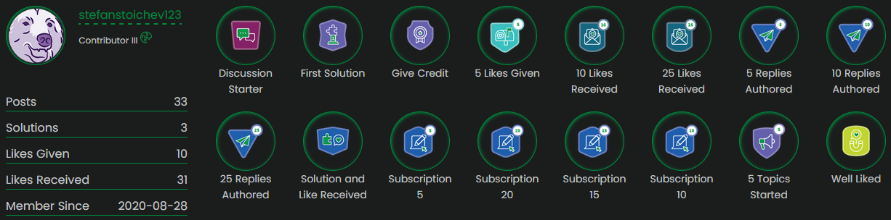

# Hi there 👋, my name is Stefan

#### Been messing with Qlik for 16+ years. Last few years I'm focused a lot more on backend and infrastructure front

- 🔭 I’m currently working on [Informatiqal](https://github.com/Informatiqal)
- 🌱 I’m currently learning Rust
- 💬 Ask me about Qlik Sense API 😄
- 📫 How to reach me: stefan.stoichev@gmail.com

 

